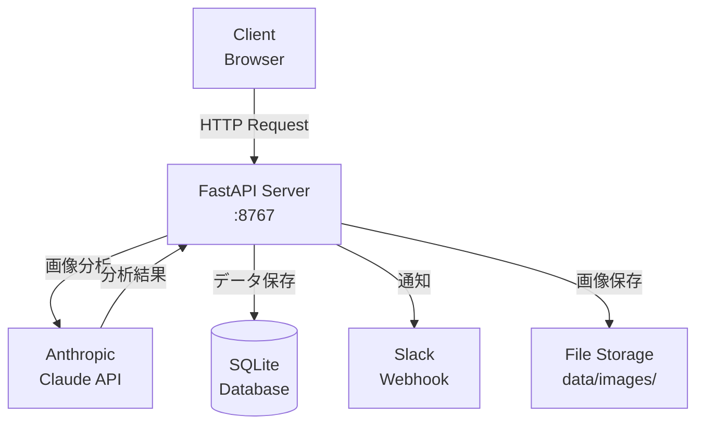
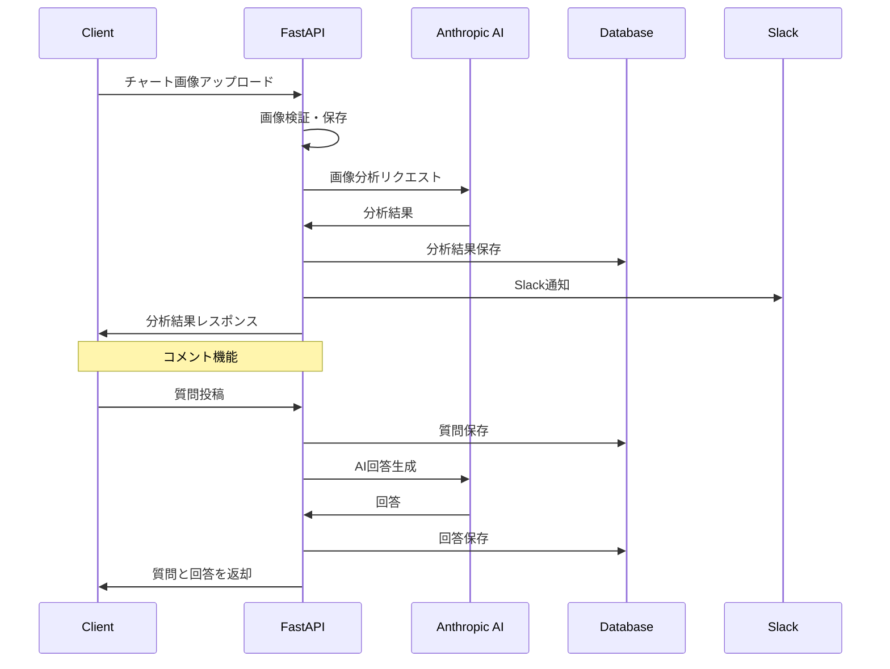

# FX予測API

AIを活用したFX（外国為替）チャート分析システムのバックエンドAPIです。

## サービス概要

本システムは、トレーダーがアップロードしたチャート画像をAIが分析し、エントリーポイントやトレンド予測などの詳細な分析結果を提供します。

### 主な機能

- **チャート画像分析**: 最大4枚のチャート画像を同時に分析し、包括的な市場分析を提供
- **トレードレビュー**: 実行済みトレードの事後分析により、トレード品質の向上を支援
- **インタラクティブなコメント機能**: 分析結果に対する質問にAIが自動応答
- **Slack通知連携**: 分析結果をリアルタイムでSlackに通知
- **履歴管理**: 過去の分析結果の参照と学習

## システム概要

### アーキテクチャ



### 技術スタック

- **Web Framework**: FastAPI (Python 3.11)
- **Database**: SQLite + SQLAlchemy ORM
- **AI**: Anthropic Claude API
- **Container**: Docker & Docker Compose
- **その他**: Pydantic (バリデーション), Alembic (マイグレーション)

### API概要

すべてのAPIは `/api/v1` プレフィックスを持ちます。

- **分析系**: チャート画像のAI分析
- **履歴系**: 過去の分析結果の取得
- **レビュー系**: トレードの事後分析
- **コメント系**: 分析結果への質問・メモ機能

詳細なAPI仕様は http://localhost:8767/docs で確認できます。

### 主要な処理フロー



## 開発環境構築

### 前提条件

- Docker Desktop
- Git

### セットアップ手順

1. **リポジトリのクローン**
   ```bash
   git clone <repository-url>
   cd fx-forecast-03/backend
   ```

2. **環境変数の設定**
   ```bash
   cp .env.example .env
   ```
   
   `.env` ファイルを編集し、以下の値を設定：
   - `ANTHROPIC_API_KEY`: Claude APIキー
   - `SLACK_WEBHOOK_URL`: Slack通知用のWebhook URL

3. **Dockerコンテナの起動**
   ```bash
   docker-compose up --build
   ```

4. **動作確認**
   - API: http://localhost:8767
   - API仕様書: http://localhost:8767/docs

### 開発用コマンド

```bash
# コンテナの起動（ビルドなし）
docker-compose up

# バックグラウンドで起動
docker-compose up -d

# ログの確認
docker-compose logs -f api

# コンテナへのアクセス
docker-compose exec api bash

# コンテナの停止
docker-compose down
```

### データベース管理

```bash
# マイグレーションの作成
docker-compose exec api alembic revision --autogenerate -m "変更内容の説明"

# マイグレーションの適用
docker-compose exec api alembic upgrade head

# マイグレーションのロールバック
docker-compose exec api alembic downgrade -1
```

### 開発時の注意事項

- コードの変更は自動的に反映されます（ホットリロード有効）
- 画像ファイルは `data/images/` 以下に保存されます
- データベースファイルは `data/fx_forecast.db` に保存されます
- すべてのタイムスタンプはJST（日本標準時）で保存されます

## トラブルシューティング

### ポート8767が使用中の場合
```bash
# 使用中のプロセスを確認
lsof -i :8767

# docker-compose.ymlでポートを変更
ports:
  - "8768:8767"  # 左側の番号を変更
```

### データベースエラーが発生した場合
```bash
# データベースを初期化（注意：全データが削除されます）
docker-compose down -v
docker-compose up --build
```

## ライセンス

本プロジェクトは非公開プロジェクトです。